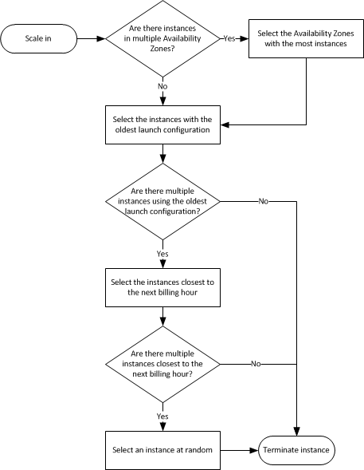

# Autoscaling

An ASG uses a  **launch configuration**. You cannot edit a launch configuration after creation.

## Scale-In Decision Tree

## Load Balancing

*ELB* is the service, *ALB*, *Classic Load Balancer*, and *NLB* are the specific service offerings.

### SSL Termination

Decryption and the SSL/TLS handshake is quite compute heavy, so 