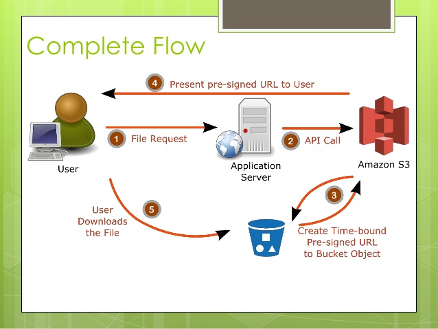
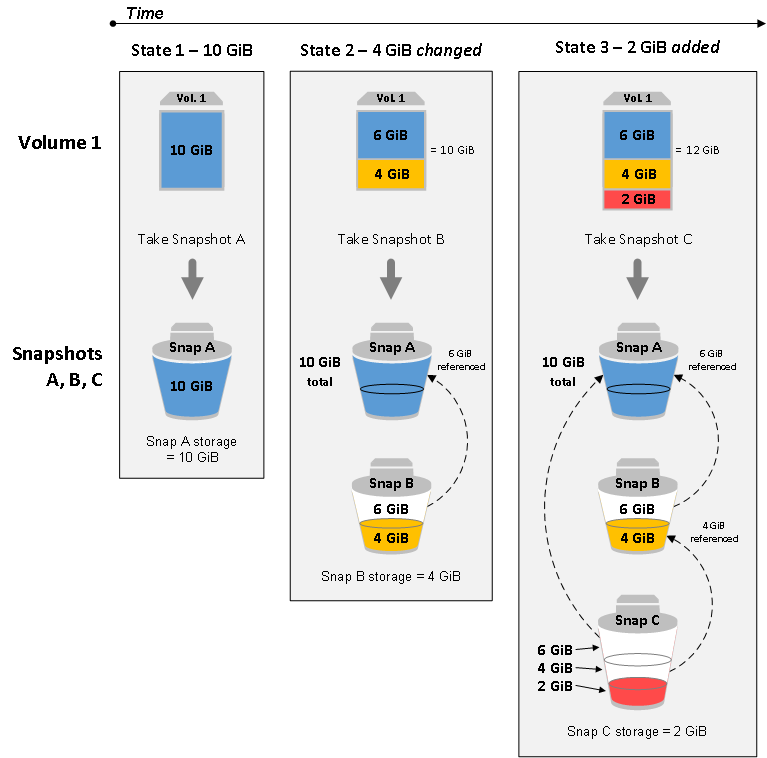

# Storage


## S3

### Presigned URLs



## EBS

### Snapshots

Snapshots are **incremental**:


The point-in-time snapshot is created immediately, but the status of the snapshot is `pending` until the snapshot is complete (when all of the modified blocks have been transferred to Amazon S3), which can take several hours for large initial snapshots or subsequent snapshots where many blocks have changed. While it is completing, an in-progress snapshot is not affected by ongoing reads and writes to the volume.


### Glacier

An **Archive** is any object, such as a photo, video, or document, that you store in a vault. It is a base unit of storage in Amazon S3 Glacier (Glacier). Each archive has a unique ID and an optional description.

To query an archive, you can use **Glacier Select**, which can perform filtering operations using simple Structured Query Language (SQL) statements directly on your data in Glacier. The archive object must be an **uncompressed CSV**

Amazon S3 Glacier supports the following archive operations: `Upload`, `Download`, and `Delete`. Archives are immutable and cannot be modified. 

A query for an archive in S3 Glacier has three data tiers:

- expedited: 1-5 minutes retrieval time
- standard: 3-5 hours retrieval time
- bulk: 5-12 hours retrieval time

A **Vault** is a container for storing archives.

A **Vault Lock policy** is a vault access policy (IAM resource policy) that you can lock. Using a Vault Lock policy can help you enforce regulatory and compliance requirements. The following policy document, for instance, prevents deletes within the vault of material less than 1 year.

```javascript
{
     "Version":"2012-10-17",
     "Statement":[
      {
         "Sid": "deny-based-on-archive-age",
         "Principal": "*",
         "Effect": "Deny",
         "Action": "glacier:DeleteArchive",
         "Resource": [
            "arn:aws:glacier:${REGION}:${ACCOUNT_ID}:vaults/${VAULT_NAME}"
         ],
         "Condition": {
             "NumericLessThan" : {
                  "glacier:ArchiveAgeInDays" : "365"
             }
         }
      }
   ]
}
```